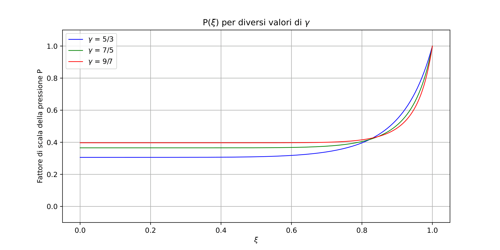
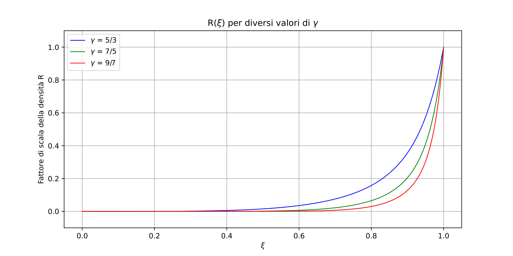
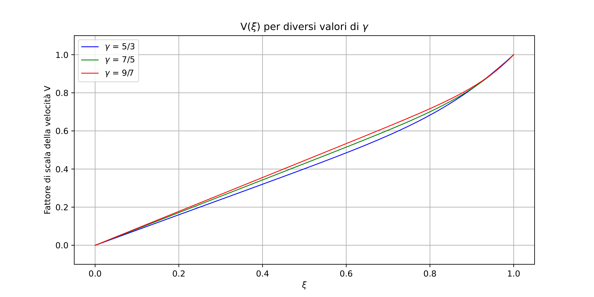

# Numerical Solution of the Sedov-Taylor Blast Wave

*A from-scratch Runge-Kutta 4 implementation for solving the hydrodynamic shock wave equations*

Completed as part of a computational physics course at **Sapienza University of Rome**, where the coursework was conducted in Italian.

---

## Overview

When a large amount of energy is released instantaneously — such as in an explosion or a supernova — the resulting pressure wave propagates outward as a **shock wave**: a sharp discontinuity in density, pressure, and velocity. The classical **Sedov-Taylor model** describes this phenomenon using a system of coupled ordinary differential equations derived from the Euler equations of fluid dynamics and a dimensional similarity analysis.

This notebook solves those equations numerically using a **fourth-order Runge-Kutta (RK4) algorithm**, implemented from scratch, and produces plots of the pressure, density, and velocity profiles inside the shocked region for three different gas types.

---

## The Physics

The Sedov-Taylor model reduces the full fluid dynamics problem to three dimensionless scaling functions — **P(ξ)**, **R(ξ)**, and **V(ξ)** — representing the profiles of pressure, density, and velocity as functions of a dimensionless radial coordinate ξ = r / Rₛ, where Rₛ is the shock front radius. The boundary conditions are P(1) = R(1) = V(1) = 1 at the shock front.

The system is brought into normal form and solved inward from ξ = 1 to ξ = 0 for three values of the adiabatic index γ, corresponding to different gas types:

| γ | Gas type |
|---|---|
| 5/3 | Monatomic (e.g. noble gases) |
| 7/5 | Diatomic (e.g. air) |
| 9/7 | Triatomic |

---

## Results

*Note: axis labels are in Italian, reflecting the language of instruction at Sapienza.*

**Pressure** — drops sharply near the shock front (ξ = 1), then levels off at a roughly constant interior value, which increases with γ.



**Density** — falls steeply inward from the shock front, approaching zero near the centre. This reflects the physical picture that the explosion sweeps all matter outward into a thin shell.



**Velocity** — decreases approximately linearly from the shock front to zero at the centre, consistent with a self-similar expansion.



The dependence on γ is consistent throughout: a higher adiabatic index corresponds to a less compressible gas, visible in the slower drop-off of density at the shock front.

---

## Implementation

The RK4 integrator is implemented from scratch as a general-purpose solver:

```python
def rk4(f, v0, t0, tf, n, V):
    t = np.linspace(t0, tf, n)
    h = t[1] - t[0]
    v = v0
    for j in range(n):
        V.append(v)
        k1 = f(v, t[j]) * h
        k2 = f(v + 0.5*k1, t[j] + 0.5*h) * h
        k3 = f(v + 0.5*k2, t[j] + 0.5*h) * h
        k4 = f(v + k3, t[j] + h) * h
        v = v + (k1 + 2*k2 + 2*k3 + k4) / 6
    return V, t
```

The three coupled ODEs for P′, R′, and V′ are passed as a single vector-valued function. The integration uses a step size of dξ = 10⁻⁶ (10⁶ steps) to ensure numerical stability and convergence — verified by confirming that halving the step size produces no visible change in the solution.

---

## Dependencies

- `numpy`
- `matplotlib`

---

## References

- Capuzzodolcetta, R. — *Physics of Fluids*
- Sedov, L. — *Similarity and Dimensional Methods in Mechanics*
